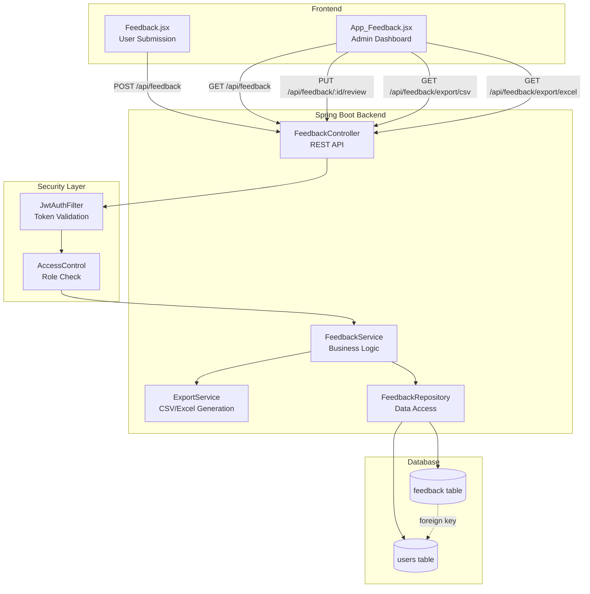
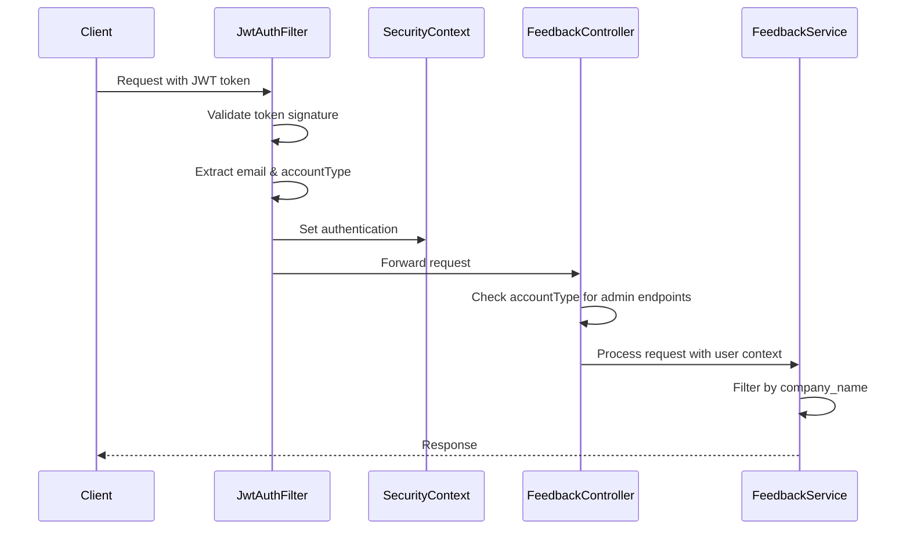

# Design Document: Company Feedback System

## Overview

The Company Feedback System is a production-grade, multi-tenant feedback management solution built on Spring Boot with React frontend. The system enables employees to submit feedback with ratings and comments, while providing administrators (PROFESSIONAL account holders) with comprehensive tools to view, manage, and export feedback data.

### Key Design Principles

1. **Multi-Tenancy**: Strict data isolation per company using company_name as the tenant identifier
2. **Security-First**: JWT-based authentication with role-based access control
3. **Real-Time Updates**: Polling mechanism for live feedback updates on admin dashboard
4. **Export Flexibility**: Support for both CSV and Excel export formats
5. **Production-Ready**: Comprehensive validation, error handling, and audit logging

### Technology Stack

- **Backend**: Spring Boot 4.0.1, Spring Security, Spring Data JPA
- **Database**: PostgreSQL with Flyway migrations
- **Authentication**: JWT (JJWT 0.11.5)
- **Export Libraries**: Apache POI 5.2.5 (Excel), Apache Commons CSV (to be added)
- **Frontend**: React with JWT token management
- **Real-Time**: HTTP polling (WebSocket infrastructure available but not used initially)

## Architecture

### System Architecture



### Multi-Tenant Architecture

The system implements multi-tenancy at the application layer using the company_name field as the tenant discriminator:

1. **Tenant Identification**: Extract company_name from authenticated user's JWT token
2. **Data Filtering**: All queries automatically filter by company_name
3. **Data Isolation**: No cross-tenant data access through any API endpoint
4. **Tenant Context**: User's company_name is immutable and set during authentication

### Security Architecture



## Components and Interfaces

### 1. Database Layer

#### Feedback Entity
```java
@Entity
@Table(name = "feedback")
public class Feedback {
    @Id
    @GeneratedValue(strategy = GenerationType.IDENTITY)
    private Long id;
    
    @ManyToOne(fetch = FetchType.LAZY)
    @JoinColumn(name = "user_id", nullable = false)
    private User user;
    
    @Column(nullable = false)
    private String companyName;
    
    @Column(nullable = false)
    private Integer rating;  // 1-5
    
    @Column(nullable = false, length = 2000)
    private String comments;
    
    @Enumerated(EnumType.STRING)
    @Column(nullable = false)
    private FeedbackStatus status;  // NEW, REVIEWED
    
    @Column(nullable = false)
    private LocalDateTime createdAt;
    
    @Column
    private LocalDateTime reviewedAt;
}
```

#### FeedbackRepository Interface
```java
public interface FeedbackRepository extends JpaRepository<Feedback, Long> {
    // Find all feedback for a specific company, ordered by creation date
    List<Feedback> findByCompanyNameOrderByCreatedAtDesc(String companyName);
    
    // Find feedback by company and status
    List<Feedback> findByCompanyNameAndStatusOrderByCreatedAtDesc(
        String companyName, 
        FeedbackStatus status
    );
    
    // Count feedback by company
    long countByCompanyName(String companyName);
    
    // Paginated queries
    Page<Feedback> findByCompanyName(String companyName, Pageable pageable);
    
    Page<Feedback> findByCompanyNameAndStatus(
        String companyName, 
        FeedbackStatus status, 
        Pageable pageable
    );
}
```

### 2. Service Layer

#### FeedbackService Interface
```java
public interface FeedbackService {
    // Submit new feedback
    FeedbackDTO submitFeedback(FeedbackSubmissionDTO dto, String userEmail);
    
    // Get feedback for admin (filtered by company)
    Page<FeedbackDTO> getFeedbackForCompany(
        String companyName, 
        FeedbackStatus status, 
        int page, 
        int size
    );
    
    // Mark feedback as reviewed
    FeedbackDTO markAsReviewed(Long feedbackId, String adminEmail);
    
    // Get feedback count
    long getFeedbackCount(String companyName);
}
```

#### ExportService Interface
```java
public interface ExportService {
    // Generate CSV export
    byte[] exportToCSV(List<FeedbackDTO> feedbackList);
    
    // Generate Excel export
    byte[] exportToExcel(List<FeedbackDTO> feedbackList);
}
```

### 3. Controller Layer

#### FeedbackController Endpoints
```java
@RestController
@RequestMapping("/api/feedback")
@CrossOrigin(origins = "http://localhost:5173")
public class FeedbackController {
    
    // Submit feedback (authenticated users)
    @PostMapping
    ResponseEntity<FeedbackDTO> submitFeedback(
        @Valid @RequestBody FeedbackSubmissionDTO dto,
        Authentication auth
    );
    
    // Get feedback list (PROFESSIONAL only)
    @GetMapping
    ResponseEntity<Page<FeedbackDTO>> getFeedback(
        @RequestParam(required = false) FeedbackStatus status,
        @RequestParam(defaultValue = "0") int page,
        @RequestParam(defaultValue = "20") int size,
        Authentication auth
    );
    
    // Mark as reviewed (PROFESSIONAL only)
    @PutMapping("/{id}/review")
    ResponseEntity<FeedbackDTO> markAsReviewed(
        @PathVariable Long id,
        Authentication auth
    );
    
    // Export to CSV (PROFESSIONAL only)
    @GetMapping("/export/csv")
    ResponseEntity<byte[]> exportCSV(Authentication auth);
    
    // Export to Excel (PROFESSIONAL only)
    @GetMapping("/export/excel")
    ResponseEntity<byte[]> exportExcel(Authentication auth);
}
```

### 4. DTO Layer

#### FeedbackSubmissionDTO
```java
public class FeedbackSubmissionDTO {
    @NotNull(message = "Rating is required")
    @Min(value = 1, message = "Rating must be at least 1")
    @Max(value = 5, message = "Rating must be at most 5")
    private Integer rating;
    
    @NotBlank(message = "Comments are required")
    @Size(max = 2000, message = "Comments must not exceed 2000 characters")
    private String comments;
}
```

#### FeedbackDTO
```java
public class FeedbackDTO {
    private Long id;
    private String userEmail;
    private String companyName;
    private Integer rating;
    private String comments;
    private FeedbackStatus status;
    private LocalDateTime createdAt;
    private LocalDateTime reviewedAt;
}
```

## Data Models

### Database Schema

#### Feedback Table (New)
```sql
CREATE TABLE feedback (
    id BIGSERIAL PRIMARY KEY,
    user_id BIGINT NOT NULL,
    company_name VARCHAR(255) NOT NULL,
    rating INTEGER NOT NULL CHECK (rating >= 1 AND rating <= 5),
    comments TEXT NOT NULL CHECK (LENGTH(comments) <= 2000),
    status VARCHAR(20) NOT NULL DEFAULT 'NEW',
    created_at TIMESTAMP NOT NULL DEFAULT CURRENT_TIMESTAMP,
    reviewed_at TIMESTAMP,
    
    CONSTRAINT fk_feedback_user FOREIGN KEY (user_id) REFERENCES users(id) ON DELETE CASCADE,
    CONSTRAINT chk_status CHECK (status IN ('NEW', 'REVIEWED'))
);

-- Indexes for performance
CREATE INDEX idx_feedback_company ON feedback(company_name);
CREATE INDEX idx_feedback_status ON feedback(status);
CREATE INDEX idx_feedback_created_at ON feedback(created_at DESC);
CREATE INDEX idx_feedback_company_status ON feedback(company_name, status);
```

### Data Flow

#### Feedback Submission Flow
1. User submits feedback through Feedback.jsx
2. Frontend sends POST request with JWT token
3. JwtAuthFilter validates token and extracts user email
4. FeedbackController receives request
5. FeedbackService looks up user by email to get user_id and company_name
6. FeedbackService creates Feedback entity with status=NEW
7. FeedbackRepository saves to database
8. Response returned with created feedback DTO

#### Feedback Retrieval Flow
1. Admin opens App_Feedback.jsx
2. Frontend sends GET request with JWT token
3. JwtAuthFilter validates token and extracts user email
4. FeedbackController checks accountType is PROFESSIONAL
5. FeedbackService looks up user to get company_name
6. FeedbackRepository queries feedback filtered by company_name
7. Results mapped to DTOs and returned

#### Export Flow
1. Admin clicks export button
2. Frontend sends GET request to /export/csv or /export/excel
3. Controller validates PROFESSIONAL account type
4. Service retrieves all feedback for company
5. ExportService generates file (CSV or Excel)
6. Controller returns file with appropriate headers
7. Browser downloads file


## Correctness Properties

A property is a characteristic or behavior that should hold true across all valid executions of a system—essentially, a formal statement about what the system should do. Properties serve as the bridge between human-readable specifications and machine-verifiable correctness guarantees.

### Property Reflection

After analyzing all acceptance criteria, I identified the following redundancies:
- Requirements 2.2, 2.3 are covered by 2.1 (multi-tenant filtering)
- Requirements 3.3 is covered by 3.1 (PROFESSIONAL access control)
- Requirements 5.3 is covered by 5.1 (CSV multi-tenancy)
- Requirements 6.4 is covered by 6.1 (Excel multi-tenancy)
- Requirements 8.4 is covered by 4.4 (status filtering)
- Requirements 9.2 is covered by 1.1 (rating validation)
- Requirements 9.5 is covered by 1.6 (validation error messages)
- Requirements 10.4 is covered by 3.2 (403 Forbidden)
- Requirements 12.1, 12.3, 12.4 are covered by 3.4 (JWT validation)

The following properties represent unique, testable behaviors:

### Property 1: Rating Validation Range
*For any* feedback submission, if the rating is outside the range 1-5, then the system should reject the submission with a validation error.

**Validates: Requirements 1.1**

### Property 2: Comments Length Validation
*For any* feedback submission, if the comments are empty or exceed 2000 characters, then the system should reject the submission with a validation error.

**Validates: Requirements 1.2**

### Property 3: Valid Feedback Persistence
*For any* valid feedback submission (rating 1-5, non-empty comments ≤2000 chars), the system should store the feedback in the database with status NEW and return the created feedback with an ID.

**Validates: Requirements 1.3, 1.5, 11.6**

### Property 4: Automatic Metadata Capture
*For any* feedback submission, the system should automatically populate the user's email, company name, and submission timestamp from the authenticated user context.

**Validates: Requirements 1.4, 2.4**

### Property 5: Validation Error Messages
*For any* invalid feedback submission, the system should return a 400 Bad Request with a descriptive error message indicating which field failed validation.

**Validates: Requirements 1.6**

### Property 6: Multi-Tenant Data Isolation
*For any* admin user querying feedback, the system should return only feedback entries where company_name matches the authenticated user's company, regardless of how many other companies have feedback in the database.

**Validates: Requirements 2.1**

### Property 7: PROFESSIONAL Access Control
*For any* request to admin endpoints (GET /api/feedback, PUT /api/feedback/:id/review, GET /api/feedback/export/*), if the authenticated user's accountType is not PROFESSIONAL, then the system should return 403 Forbidden.

**Validates: Requirements 3.1**

### Property 8: JWT Authentication Required
*For any* request to feedback endpoints without a valid JWT token (missing, expired, or invalid signature), the system should return 401 Unauthorized.

**Validates: Requirements 3.4, 12.1**

### Property 9: Status Transition to REVIEWED
*For any* feedback entry with status NEW, when an admin marks it as reviewed, the system should update the status to REVIEWED and set the reviewedAt timestamp.

**Validates: Requirements 4.1, 4.2**

### Property 10: Status Field Presence
*For any* feedback query response, each feedback entry should include a status field with value NEW or REVIEWED.

**Validates: Requirements 4.3**

### Property 11: Status Filtering
*For any* feedback query with a status filter (NEW or REVIEWED), the system should return only feedback entries matching that status for the user's company.

**Validates: Requirements 4.4**

### Property 12: CSV Export Multi-Tenancy
*For any* admin user requesting CSV export, the generated CSV file should contain only feedback entries where company_name matches the authenticated user's company.

**Validates: Requirements 5.1**

### Property 13: CSV Column Completeness
*For any* CSV export, the file should include columns for ID, rating, comments, user email, company name, status, submission timestamp (createdAt), and review timestamp (reviewedAt).

**Validates: Requirements 5.2**

### Property 14: Excel Export Multi-Tenancy
*For any* admin user requesting Excel export, the generated Excel file should contain only feedback entries where company_name matches the authenticated user's company.

**Validates: Requirements 6.1**

### Property 15: Excel Column Completeness
*For any* Excel export, the file should include columns for ID, rating, comments, user email, company name, status, submission timestamp (createdAt), and review timestamp (reviewedAt).

**Validates: Requirements 6.2**

### Property 16: Pagination Support
*For any* feedback query with page and size parameters, the system should return at most 'size' feedback entries starting from page 'page', along with the total count of feedback entries for the company.

**Validates: Requirements 8.1, 8.3**

### Property 17: Timestamp Sorting
*For any* feedback query without explicit sorting, the system should return feedback entries ordered by createdAt timestamp in descending order (newest first).

**Validates: Requirements 8.2**

### Property 18: Response Field Completeness
*For any* feedback query response, each feedback entry should include all required fields: ID, rating, comments, user email, company name, status, createdAt, and reviewedAt.

**Validates: Requirements 8.5**

### Property 19: XSS Prevention
*For any* feedback submission containing HTML or JavaScript code in comments, the system should either sanitize the input or store it safely such that it cannot execute when displayed.

**Validates: Requirements 9.1**

### Property 20: SQL Injection Safety
*For any* feedback submission containing SQL-like patterns in comments (e.g., "'; DROP TABLE users; --"), the system should store the comments safely without executing SQL commands.

**Validates: Requirements 9.3**

### Property 21: Whitespace Trimming
*For any* feedback submission with leading or trailing whitespace in comments, the system should trim the whitespace before storing.

**Validates: Requirements 9.4**

## Error Handling

### Error Response Format
All error responses follow a consistent structure:
```json
{
    "timestamp": "2024-01-15T10:30:00Z",
    "status": 400,
    "error": "Bad Request",
    "message": "Validation failed: Rating must be between 1 and 5",
    "path": "/api/feedback"
}
```

### Error Categories

#### 1. Validation Errors (400 Bad Request)
- Invalid rating (not 1-5)
- Empty comments
- Comments exceeding 2000 characters
- Missing required fields

#### 2. Authentication Errors (401 Unauthorized)
- Missing JWT token
- Expired JWT token
- Invalid JWT signature
- Malformed JWT token

#### 3. Authorization Errors (403 Forbidden)
- PERSONAL user attempting to access admin endpoints
- User attempting to access another company's feedback
- User attempting to modify feedback from another company

#### 4. Not Found Errors (404 Not Found)
- Feedback ID does not exist
- User not found in database

#### 5. Server Errors (500 Internal Server Error)
- Database connection failures
- Export generation failures
- Unexpected exceptions

### Error Handling Strategy

1. **Input Validation**: Use Spring's @Valid annotation with custom validators
2. **Global Exception Handler**: @ControllerAdvice to catch and format all exceptions
3. **Logging**: Log all errors with context (user email, company, timestamp, stack trace)
4. **User-Friendly Messages**: Return clear, actionable error messages
5. **Security**: Don't expose internal implementation details in error messages

### Logging Strategy

```java
// Audit logging for feedback submissions
log.info("Feedback submitted: userId={}, companyName={}, rating={}", 
    userId, companyName, rating);

// Error logging with context
log.error("Failed to export CSV: userEmail={}, companyName={}, error={}", 
    userEmail, companyName, e.getMessage(), e);

// Security logging
log.warn("Unauthorized access attempt: endpoint={}, userEmail={}, accountType={}", 
    endpoint, userEmail, accountType);
```

## Testing Strategy

### Dual Testing Approach

The system requires both unit tests and property-based tests for comprehensive coverage:

- **Unit tests**: Verify specific examples, edge cases, and error conditions
- **Property tests**: Verify universal properties across all inputs

Both approaches are complementary and necessary. Unit tests catch concrete bugs in specific scenarios, while property tests verify general correctness across a wide range of inputs.

### Property-Based Testing Configuration

- **Library**: Use a Java property-based testing library (e.g., jqwik, QuickTheories, or junit-quickcheck)
- **Iterations**: Minimum 100 iterations per property test
- **Tagging**: Each property test must reference its design document property

Tag format:
```java
/**
 * Feature: company-feedback-system
 * Property 6: Multi-Tenant Data Isolation
 * 
 * For any admin user querying feedback, the system should return only 
 * feedback entries where company_name matches the authenticated user's company.
 */
@Property
void multiTenantDataIsolation() { ... }
```

### Unit Testing Focus

Unit tests should focus on:
- Specific validation examples (rating=0, rating=6, empty comments)
- Edge cases (exactly 2000 characters, whitespace-only comments)
- Error conditions (database failures, invalid tokens)
- Integration points (JWT extraction, user lookup)
- Export formatting (CSV structure, Excel formatting)

### Property Testing Focus

Property tests should focus on:
- Universal validation rules (all ratings outside 1-5 rejected)
- Multi-tenancy isolation (no cross-company data leakage)
- Authorization rules (all non-PROFESSIONAL users blocked)
- Data integrity (all submissions persisted correctly)
- Export completeness (all company feedback included)

### Test Data Generation

For property-based tests, generate:
- Random ratings (including invalid values)
- Random comment strings (various lengths, special characters)
- Random company names
- Random user emails
- Random timestamps
- Random account types (PROFESSIONAL, PERSONAL)

### Integration Testing

Integration tests should verify:
- End-to-end feedback submission flow
- End-to-end feedback retrieval with filtering
- End-to-end export generation
- JWT authentication integration
- Database transaction handling
- Multi-tenant data isolation across concurrent requests

### Test Coverage Goals

- Line coverage: >80%
- Branch coverage: >75%
- All 21 correctness properties: 100% implemented
- All error scenarios: Covered by unit tests
- All API endpoints: Integration tested
